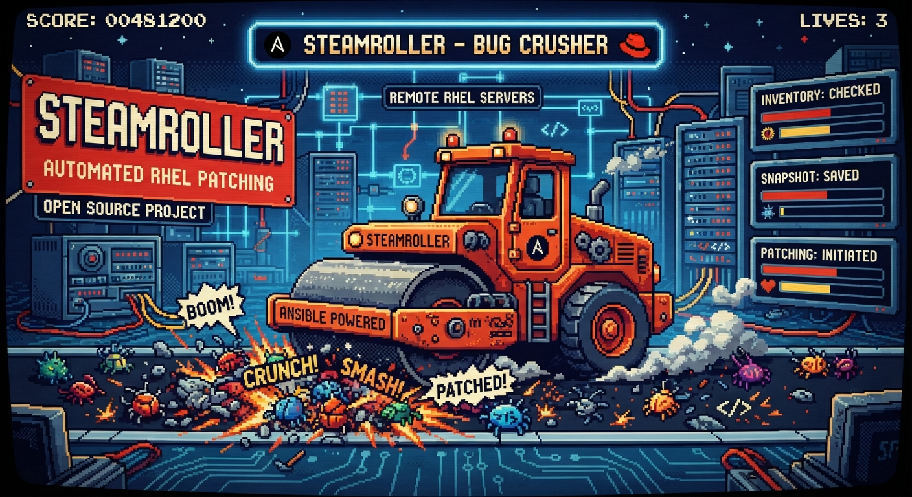

# SteamRoller

<p align="center">
  
</p>

SteamRoller is an operator-oriented Ansible tool for assessing remote Red Hat
Enterprise Linux 9 systems from a RHEL 9 or RHEL 10 control node. It provides
multi-host prechecks, persistent evidence, repository safety controls, and a
confirmed single-host reboot workflow.

Current version: **0.2.0**

## Highlights

- multi-host inventories with built-in create, add, delete, and list commands;
- SSH connectivity and root-execution validation;
- dedicated SSH key profiles with automatic private-key discovery;
- RHEL, kernel, uptime, DNF/RPM, disk, inode, fstab, network, and systemd checks;
- Red Hat CDN and Satellite auto-detection, including Simple Content Access;
- Satellite Organization, Lifecycle Environment, Content View, and repository evidence;
- custom `.repo` detection and explicit repository quarantine with local backup;
- PostgreSQL package, provenance, and available-version reporting;
- controlled reboot of exactly one inventory host with PRE/POST validation;
- interactive DNF update of exactly one inventory host with native confirmation;
- readable fleet summaries plus per-host text and JSON reports;
- Bash completion for commands, inventories, hosts, options, and SSH profiles.

SteamRoller does **not** perform unattended fleet updates, change Satellite
assignments, or coordinate clusters and HA applications.

## Requirements

Control node:

- RHEL 9 or RHEL 10;
- Ansible Core;
- Python 3 and PyYAML;
- OpenSSH client and `ping`;
- Git for source-based installation.

Managed hosts:

- RHEL 9.x;
- SSH access;
- Python available to Ansible;
- root access, currently used directly by the initial release.

## Quick start from source

```bash
git clone https://github.com/markhawks/SteamRoller.git
cd SteamRoller

./setup/manual/install-source-path.sh
source /root/.bashrc

steamroller version
```

The installer adds the current checkout to root's `PATH`, enables Bash
completion, creates a timestamped `.bashrc` backup, and is safe to run again.

Create an inventory:

```bash
steamroller inventory create -i ORION-LAB \
  -h velora-db-a01.ops.example \
  -h velora-db-a02.ops.example
```

Create an SSH key profile:

```bash
mkdir -p ssh-keys/foreman
cp /secure/path/id_rsa_foreman_proxy ssh-keys/foreman/
chmod 700 ssh-keys ssh-keys/foreman
chmod 600 ssh-keys/foreman/id_rsa_foreman_proxy
```

Run connectivity and precheck:

```bash
steamroller connectivity ORION-LAB -q -sk foreman
steamroller precheck ORION-LAB -q -sk foreman
```

If only one managed private key exists, `-sk foreman` can be omitted.

## Safe mutating operations

Normal precheck is read-only. Repository quarantine is performed only when the
operator explicitly requests it:

```bash
steamroller repo-off ORION-LAB -q -sk foreman

# Or quarantine first, then run precheck:
steamroller precheck ORION-LAB --repo-off -q -sk foreman
```

This backs up custom `.repo` files locally before moving them beneath
`/etc/yum.repos.d/SteamRoller-RepoOff/RUN_ID/` on the managed host.

Reboot requires one exact inventory host and interactive confirmation unless
`--confirm` is supplied:

```bash
steamroller reboot ORION-LAB \
  --host velora-db-a01.ops.example \
  -sk foreman
```

SteamRoller never interprets reboot as an entire-inventory operation.

An update also targets exactly one host. It runs the full precheck first,
stops on any blocking failure, then displays the native DNF transaction and
requires the operator to answer DNF's `Is this ok [y/N]` prompt:

```bash
steamroller update ORION-LAB \
  --host velora-db-a01.ops.example \
  -sk foreman
```

The update command requires an interactive terminal, has no quiet mode, saves
the DNF transaction log, performs post-update validation, and never reboots
the host automatically. Its final summary prints the complete SteamRoller
reboot command for that host.

For legacy installations that modified the vendor PostgreSQL systemd unit,
SteamRoller can preserve it during the update:

```bash
steamroller update ORION-LAB \
  --host velora-db-a01.ops.example \
  -sk foreman \
  --preserve-postgresql-unit restore
```

Use `backup` instead of `restore` to collect the original unit and a diff
without replacing the newly installed vendor file. Long term, custom settings
should be moved to `/etc/systemd/system/postgresql.service.d/override.conf`.

The option values are available with Tab completion:

```bash
steamroller update ORION-LAB --host velora-db-a01.ops.example \
  --preserve-postgresql-unit <TAB><TAB>
# backup  restore
```

`restore` is deliberately explicit. SteamRoller restores the file only when
RPM verification identifies it as locally modified (or when the file is not
owned by an RPM). It verifies the restored checksum, reloads systemd, validates
the unit, and reports a failure if any of those checks fail. It does not restart
the database service.

## Reports

Source checkouts store reports beneath:

```text
reports/SERVER_NAME/RUN_ID/
```

Precheck evidence includes `precheck.txt`, `summary.json`, `checks.json`,
filesystem, mount, kernel, network, repository, Satellite, systemd, update, and
PostgreSQL details. Update runs add the complete DNF transaction and postcheck;
reboot runs preserve evidence before reboot and create a POST validation
report after the host returns.

With PostgreSQL unit protection enabled, the update report also contains the
unit before and after DNF, metadata, `systemctl cat` evidence, a unified diff,
and—when requested—the restored unit.

List runs with:

```bash
steamroller status
```

## Configuration and security

- global defaults: `config/steamroller.yml`;
- inventories: `inventories/ENVIRONMENT/hosts.yml`;
- optional environment settings: `inventories/ENVIRONMENT/steamroller.yml`;
- managed SSH profiles: `ssh-keys/PROFILE/PRIVATE_KEY`;
- real inventories, reports, backups, and private keys are excluded from Git;
- SSH host-key checking remains enabled;
- repository files are never moved without an explicit operator option.

Display effective settings with:

```bash
steamroller config ENVIRONMENT
```

## Documentation

- [Complete command HOWTO](docs/HOWTO.md)
- [Project status](PROJECT_STATUS.md)
- [Version 0.2.0 release notes](docs/RELEASE_NOTES_0.2.0.md)
- [Manual setup utilities](setup/README.md)

## Planned installed layout

```text
/opt/steamroller/                    application code
/etc/steamroller/                    configuration
/etc/steamroller/inventories/        inventories
/etc/steamroller/ssh-keys/           managed SSH identities
/var/lib/steamroller/reports/        persistent evidence
/var/log/steamroller/                operational logs
/usr/bin/steamroller                 operator entry point
```

RPM production and installation validation remain deferred until the
source-based 0.2 series is accepted on real customer systems.

## License

Copyright (C) 2026 markhawks and SteamRoller contributors.

SteamRoller is free software licensed under the GNU Affero General Public
License, version 3 or any later version (`AGPL-3.0-or-later`). It is distributed
without warranty. See [LICENSE](LICENSE) for the complete terms.
